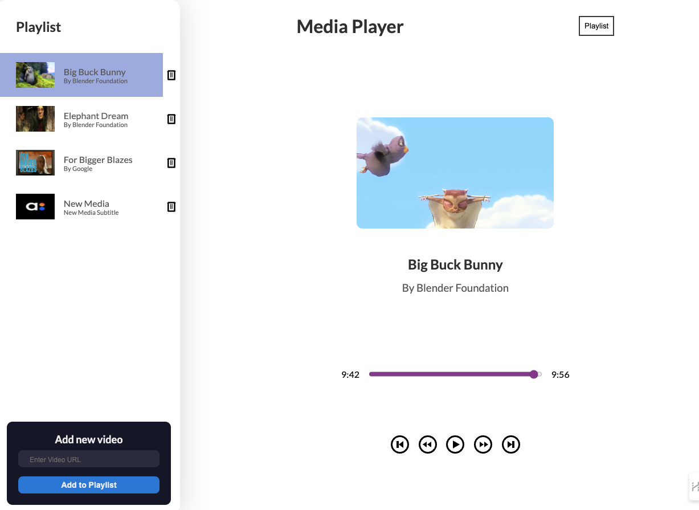

# React + TypeScript + SCCS + Vite

Media Player Accedo.tv
============================

Welcome to the Media Player Accedo.tv! This application provides a dynamic and interactive exploration of the Accedo.tv Media Player. The application is built using React, TypeScript, and SCSS, and is bundled using Vite. The application is designed to provide a seamless and intuitive user experience, allowing users to interact with the media player and playlist in a simple and straightforward manner. The application is also fully responsive, ensuring that it looks great and functions perfectly on all devices. 


Getting Started
------------------

These instructions will get you a copy of the project up and running on your local machine for development and testing purposes.

### Prerequisites

Ensure you have the following tools installed and running on your system:

*   [Node.js](https://nodejs.org/) (v18.x or later)
*   A modern code editor like Visual Studio Code
*   [Git](https://git-scm.com/) for version control

### Installation

Follow these simple steps to get your development environment running:

1.  **Clone the repository**
    
    `git clone https://github.com/MilosTanaskovic/media-player-accedo.git`
    
2.  **Navigate to the project directory**
    
    `cd media-player-accedo`
    
3.  **Install dependencies**
    
    `npm install`

### Running the Application

4.   **Start the development server**
    
    `npm run dev`
    -> Open http://localhost:5173 in your browser to view the running application

5.   **Build for Production**
    
    `npm run build`


Deployed Project Link
-------------------

Experience the Media Player Accedo in action by visiting the [live version here](https://media-player-accedo.app/).


Project Structure and Funtionalities
-------------------------------------

## Folder Structure
Atomic Design Methodology (atoms, molecules, organisms...)
Here's an overview of the project's directory structure:

```
media-player-accedo/
├── public/                                  # Static files (such as images, icons) that are publicly accessible
├── src/                                     # Main application source code
│   ├── assets/                              # Assets like images, fonts, etc.
│   │   └── ...
│   ├── components (organisms)/              # Atomic Design Methodologies (organisms). Reusable React components/organisms used throughout the application
│   ├── context/                             # Global application context providers
│   ├── data/                                # Mock data for the media playlist
│   ├── designsystem (atoms, molecules)/     # Atomic Design Methodologies (atoms, molecules). Reusable React components/molecules used throughout the application
│   ├── styles/                              # Global and shared styles and SCSS mixins
│   ├── types/                               # Global Media Player types and interfaces
│   ├── utils/                               # Reusable utility functions
│   ├── App.tsx                              # Main application component
│   └── index.tsx                            # React DOM renderer and entry point
├── .gitignore                               # Git ignore file
├── package.json                             # The list of project dependencies and NPM scripts
├── README.md                                # Project documentation
├── tsconfig.json                            # TypeScript configuration
├── vite.config.ts                           # Vite configuration
```
## Project Prototype


## Project Features/Functionalities
The main functionalities of the Media Player application include:

- Display 3 medai by default.
- Allow user to play/pause, fast backwards/forwards 10 seconds, skip to next/previous media using player controls component.
- Auto skip to next media when current media ends.
- Show current playing time and total duration.
- Implementing keyboard controls to control playback.
- Add media to playlist.
- Remove media from playlist.
- Highlight the currently played media in the playlist.
- Providing accessibility features such as keyboard support and ARIA attributes.
- Being fully responsive on all devices with a fluid and adaptive layout.

## Mobile View


## Tablet View



## Desktop View


